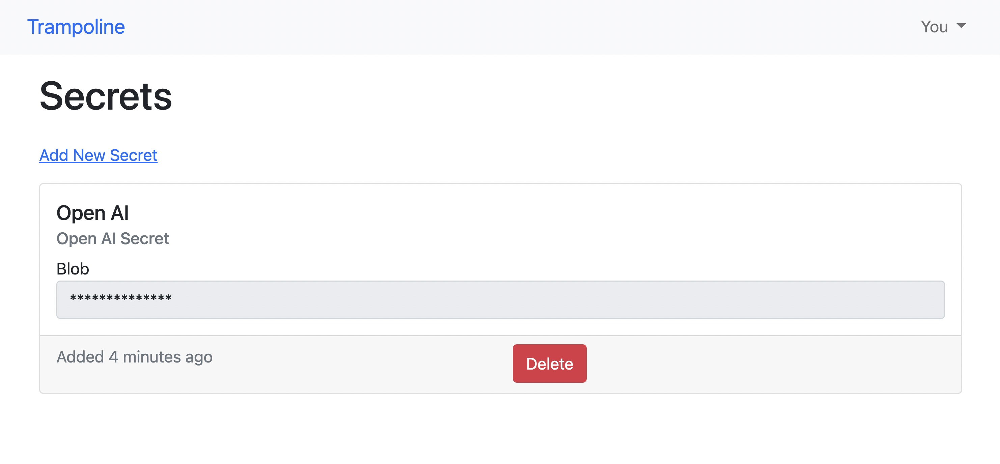
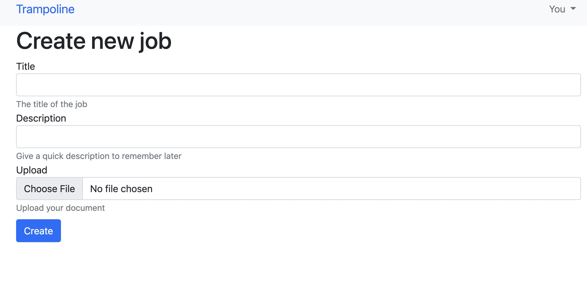
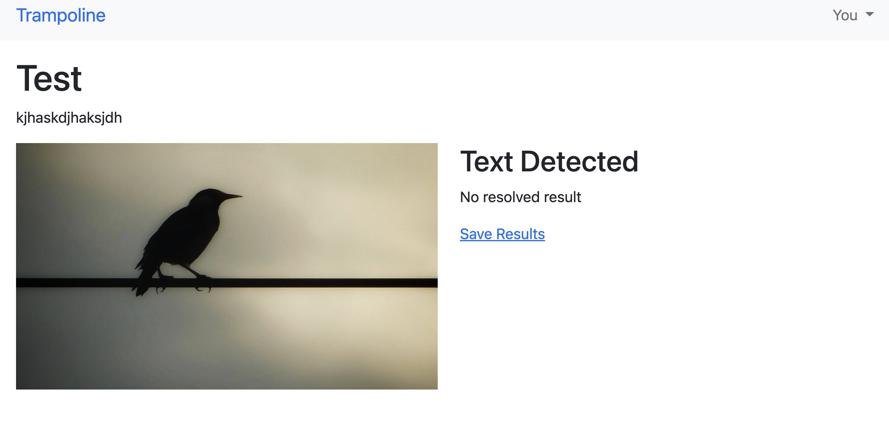
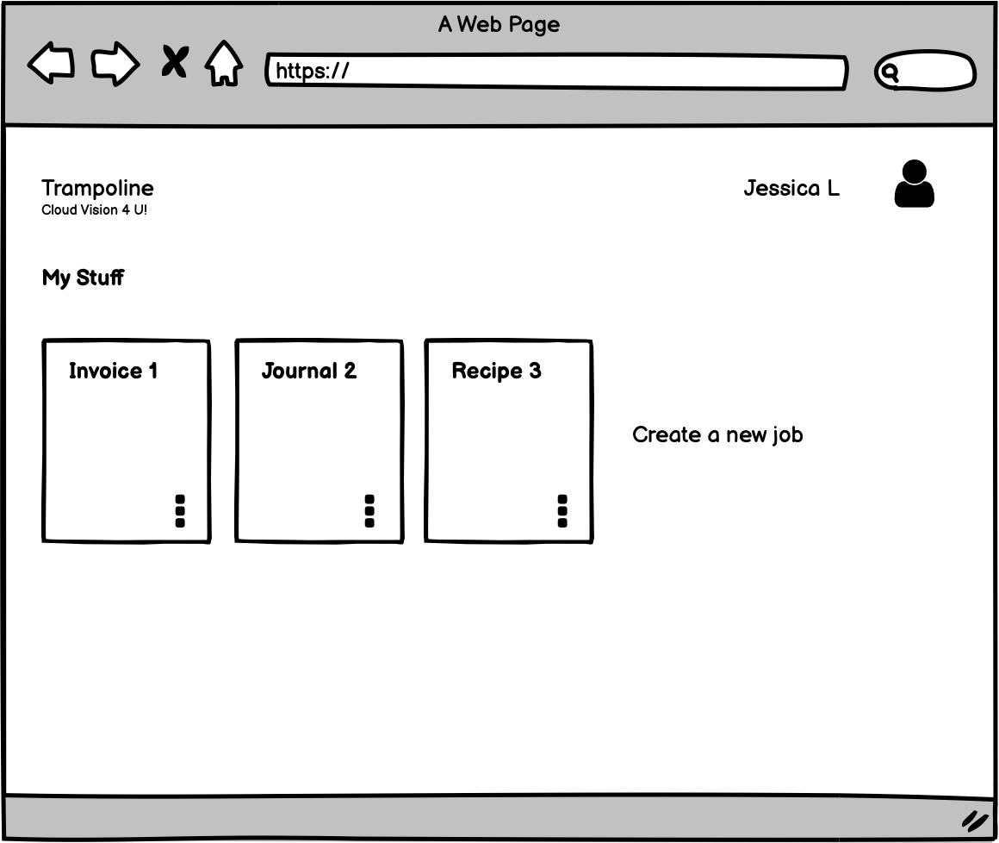
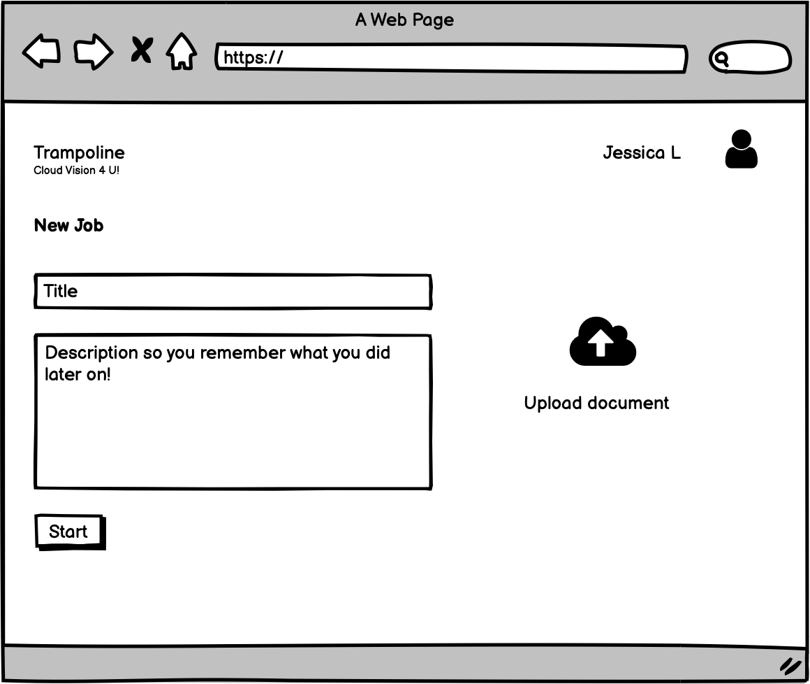
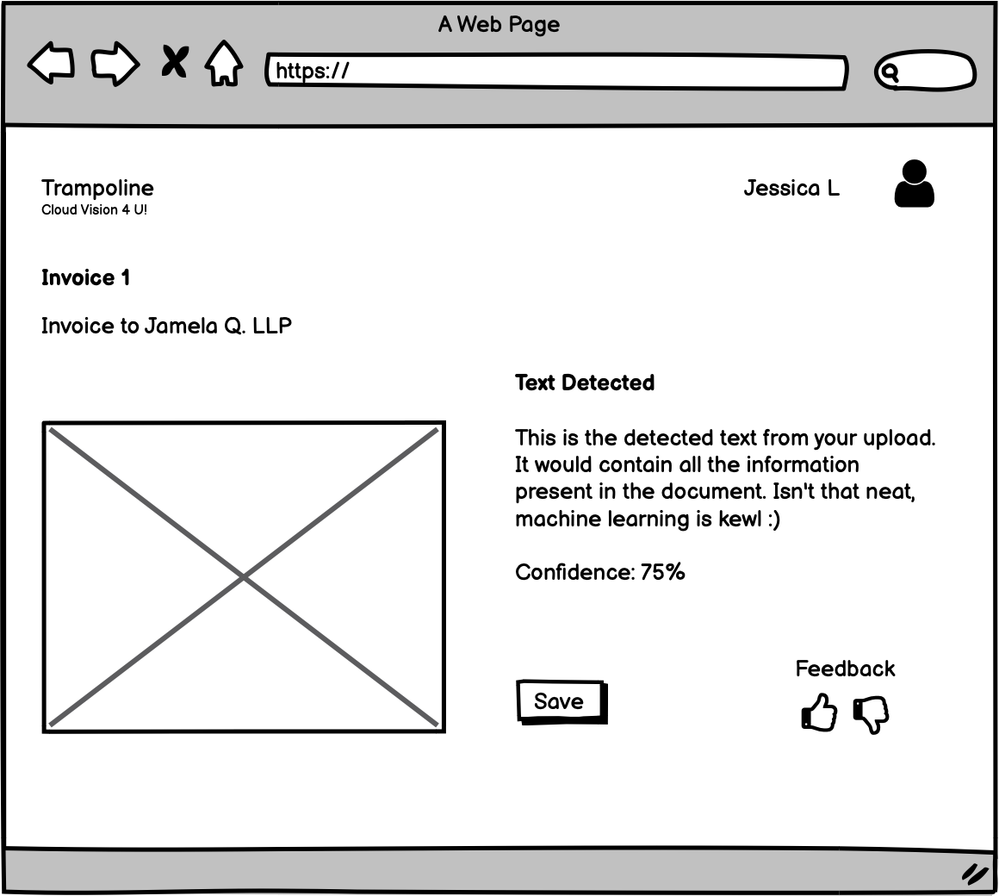

# Trampoline

Small web application over basic Google Cloud APIs.

## Build
1. Clone the repository
2. Install dependencies `bundle install` 
3. Run the Makefile `make docker.start`
4. Run migrations `docker exec trampoline-app-1 rails db:migrate`

## Usage
1. Go to the Secrets page and add your Google Cloud Platform secret and Open AI token

2. Upload a document to do text analysis on

The image will be uploaded to Google Cloud Vision's APIs to perform Text Detection. Once the results come back, they will be run through Open AI to perform grammar and spelling detection.

3. View your results by clicking the card

## Details
Secrets are stored in the local Docker volume so if you lose the volume the secrets will be deleted :D 

## Mocks
Prototypes mocks

